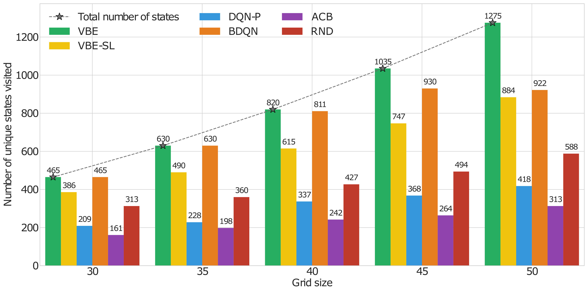

# Value Bonuses using Ensemble Errors for Exploration in Reinforcement Learning

<p align="center">
    <a href="https://openreview.net/forum?id=fOoB8R5ofS">
        
    </a>
</p>



If you find our code or paper helpful, please consider starring our repository and citing:
```
@inproceedings{
    wahab2025value,
    title={Value Bonuses using Ensemble Errors for Exploration in Reinforcement Learning},
    author={Abdul Wahab and Raksha Kumaraswamy and Martha White},
    booktitle={Reinforcement Learning Conference},
    year={2025},
    url={https://openreview.net/forum?id=fOoB8R5ofS}
}
```
  
## Setup Environment
To run the code you will need the packages in the files: `requirements.txt` and `setup.sh`.
```
pip install -r requirements.txt
bash setup.sh
```

## Running Pure Exploration experiments
Use the following commands to run the pure exploration experiments. There are separate config files in `parameters/` for each grid size : `[30, 35, 40, 45, 50]`. 

```
# VBE
python online_experiment_eval_repeats.py  --json_file parameters/opi_outofsample_exploration/deep_sea30x30_opi_nn_linear.json --id 0 --config_num 0 --run_num 0

# VBE-SL
python online_experiment_eval_repeats.py  --json_file parameters/opi_supervised_exploration/deep_sea30x30_opi_nn_linear.json --id 0 --config_num 0 --run_num 0

# BDQN
python online_experiment_eval_repeats.py  --json_file parameters/bootdqn_exploration/deep_sea30x30_bootdqn.json --id 0 --config_num 0 --run_num 0

# ACB
python online_experiment_eval_repeats.py  --json_file parameters/ofu_acb_exploration/deep_sea30.json --id 0 --config_num 0 --run_num 0

# RND
python online_experiment_eval_repeats.py  --json_file parameters/ofu_rnd_exploration/deep_sea30.json --id 0 --config_num 0 --run_num 0
```

## Running Control experiments
 Use the following commands for running Control experiments with linear function approximation and tilecoding. The config files for each agent type and environment are in the `parameters/` directory. The `--config_num` argument controls which set of parameters are used for the experiment. 
```
# VBE
python online_experiment_eval_repeats.py --json_file parameters/opi_outofsample_linear/rs.json --id 0 --config_num 0 --run_num 0 

# VBE-SL
python online_experiment_eval_repeats.py --json_file parameters/opi_supervised_linear/rs.json --id 0 --config_num 0 --run_num 0

# BDQN
python online_experiment_eval_repeats.py --json_file parameters/bootdqn_linear/rs.json --id 0 --config_num 0 --run_num 0

# ACB
python online_experiment_eval_repeats.py --json_file parameters/ofu_acb/rs.json --id 0 --config_num 0 --run_num 0

# RND
python online_experiment_eval_repeats.py --json_file parameters/ofu_rnd/rs.json --id 0 --config_num 0 --run_num 0
```

Use the following commands to run Control experiments with non-linear function approximation. 

```
# VBE
python online_experiment_eval_repeats.py --json_file parameters/opi_outofsample_NN/rs.json --id 0 --config_num 0 --run_num 0

# VBE-SL
python online_experiment_eval_repeats.py --json_file parameters/opi_supervised_NN/rs.json --id 0 --config_num 0 --run_num 0

# BDQN
python online_experiment_eval_repeats.py --json_file parameters/bootdqn_NN/rs.json --id 0 --config_num 0 --run_num 0

# ACB
python online_experiment_eval_repeats.py --json_file parameters/ofu_acb_nn/rs.json --id 0 --config_num 0 --run_num 0

# RND
python online_experiment_eval_repeats.py --json_file parameters/ofu_rnd_nn/rs.json --id 0 --config_num 0 --run_num 0
```

### Note: 
We will be pushing code for Atari soon. 